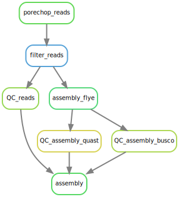
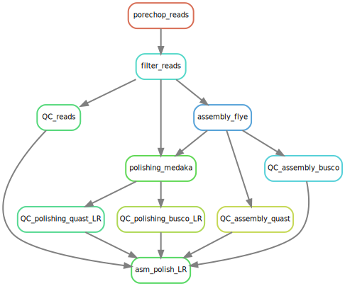
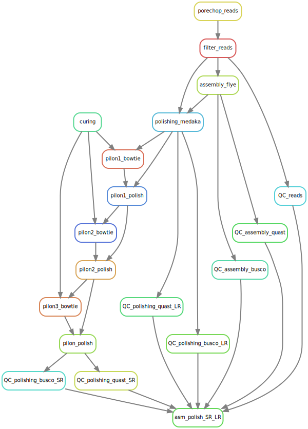

<style>
blue { color: blue }
yellow { color: yellow }
</style>

# Pipeline Assemblage Asselidae Nanopore(Flye)
## Short description
<blue>**{ARG}**</blue> --> argument from the config.yaml or the one you give in your comment see run the pipeline section 
## Dependancies
- conda
- snakemake

## Input
### Nanopore Long-reads 
The reads should be reunited in a folder and can be gzipped or not (.fastq or .fastq.gz) like:

```
    long_reads_folder
    ├── 01022023_FAW03579_porechoped.fastq.gz
    ├── fastq_runid_ca9af3b5ba9ac03d97b156b20e01b9f569911a7f_44_0.fastq.gz
    ├── fastq_runid_gyfgidgfilga9ac03d97b156b20e01b9f569911a7f_12_0.fastq
    └── fastq_runid_ca9af3b5ba9ac03d97b156b20e01b9f569911a7f_44_0.fastq
```

You need to give the fullpath to "long_reads_folder" like : /beegfs/data/gdebaecker/Proasellus_meridianus/ont_fastq/

### Illumina Short-reads (optional)
The reads can be gzipped or not (.fastq or .fastq.gz).
You need to give the fullpath to both short-reads file (aka R1 & R2) : 

/beegfs/data/gdebaecker/Proasellus_coiffaiti/sr_fastq/PC_shortreads_concat_PE_R1.fastq.gz

/beegfs/data/gdebaecker/Proasellus_coiffaiti/sr_fastq/PC_shortreads_concat_PE_R2.fastq.gz

## Run the pipeline 


```
LONG_READ=""
OUT_DIR=""
GENOME_SIZE=""
MIN_LEN_LR=""
MIN_Q_LR=""
ASM_NAME=""
BUSCO_DB=""  ###voir /beegfs/home/gdebaecker/busco_list.txt
SHORT_R1=""
SHORT_R2=""
MIN_LEN=""    ##short reads
MIN_Q=""      ##short reads

##chose one of the next option and comment the two other

##assembly and polishing (medaka) with only ont 
snakemake asm_polish_LR -j 16 --use-conda -C reads_folder=$LONG_READ out_dir=$OUT_DIR genome_size=$GENOME_SIZE min_len_LR=$MIN_LEN_LR min_q=$MIN_Q_LR asm_name=$ASM_NAME  busco_db=$BUSCO_DB 


## ##assembly and polishing with ont (medaka) then with short-reads(pilon)
snakemake asm_polish_SR_LR -j 16 --use-conda -C reads_folder=$LONG_READ out_dir=$OUT_DIR genome_size=$GENOME_SIZE min_len_LR=$MIN_LEN_LR min_q=$MIN_Q_LR min_len=$MIN_LEN min_q=$MIN_Q asm_name=$ASM_NAME  busco_db=$BUSCO_DB short_r1=$SHORT_R1 short_r2=$SHORT_R2

## assembly ont (without polishing)
snakemake ont_only -j 16 --use-conda -C reads_folder=$LONG_READ out_dir=$OUT_DIR genome_size=$GENOME_SIZE min_len_LR=$MIN_LEN_LR min_q=$MIN_Q_LR asm_name=$ASM_NAME busco_db=$BUSCO_DB

```

### exemple 
```
#!/bin/bash
#SBATCH --partition=normal
#SBATCH --nodes=1
#SBATCH --cpus-per-task=16
#SBATCH --time=68:00:00
#SBATCH --mem=100G
#SBATCH --output=/beegfs/home/gdebaecker/out_error/test_pipeline_rework.out
#SBATCH --error=/beegfs/home/gdebaecker/out_error/test_pipeline_rework.e
#SBATCH --job-name=test_pipeline_rework
#SBATCH --mail-type=ALL
#SBATCH --mail-user='gautier.debaecker@univ-lyon1.fr'

source /beegfs/data/soft/bioconda/etc/profile.d/conda.sh
cd /beegfs/project/nega/script_pipeline_gautier/pipeline_flye_medaka_bowtie_pilon


LONG_READ="/beegfs/data/briolay/brochier/CEBR_20211124_S29_RB01_run1/S29_RB01/20211124_1225_MN19758_FAR26110_236062f9/fastq_sup/pass"
OUT_DIR="/beegfs/data/gdebaecker/output_pipeline_rework"
GENOME_SIZE="5000000"
MIN_LEN_LR="20000"
MIN_Q_LR="10"
ASM_NAME="assembly_flye_pilon_A6067"
BUSCO_DB="proteobacteria_odb10"  ###voir /beegfs/home/gdebaecker/busco_list.txt
SHORT_R1="/beegfs/data/briolay/brochier/S29_S6_L001_R1_001_trimmed.fastq"
SHORT_R2="/beegfs/data/briolay/brochier/S29_S6_L001_R2_001_trimmed.fastq"
MIN_LEN="80"    ##short reads
MIN_Q="30"      ##short reads

snakemake asm_polish_SR_LR -j 16 --use-conda -C reads_folder=$LONG_READ out_dir=$OUT_DIR genome_size=$GENOME_SIZE min_len_LR=$MIN_LEN_LR min_q=$MIN_Q_LR min_len=$MIN_LEN min_q=$MIN_Q asm_name=$ASM_NAME  busco_db=$BUSCO_DB short_r1=$SHORT_R1 short_r2=$SHORT_R2

```


## OUTPUT
### NANOPLOT
<blue>**{out_dir}**</blue>/QC/nanoplot/NanoPlot-report.html --> html report from nanoplot with all the QC stats and graph for the reads

<blue>**{out_dir}**</blue>/QC/nanoplot/NanoStats.txt --> small txt file with quick reads stats

### trimomatics
<blue>**{out_dir}**</blue>/reads/R1_trim_paired.fastq.gz --> paired reads cured with trimomatics, will be use for the polishing 

<blue>**{out_dir}**</blue>/reads/R2_trim_paired.fastq.gz --> paired reads cured with trimomatics, will be use for the polishing


<blue>**{out_dir}**</blue>/reads/R1_trim_unpaired.fastq.gz --> unpaired reads cured with trimomatics, won't be use for the polishing

<blue>**{out_dir}**</blue>/reads/R2_trim_unpaired.fastq.gz --> unpaired reads cured with trimomatics, won't be use for the polishing

### Flye
<blue>**{out_dir}**</blue>/assembly_flye_hq/<blue>**{asm_name}**</blue>_asm_flyeHQ.fasta --> draft assembly from flye

### Medaka
<blue>**{out_dir}**</blue>/polishing_medaka/<blue>**{asm_name}**</blue>_flyeHQ_medaka.fasta --> polished assembly from medaka (long read)

### Pilon
<blue>**{out_dir}**</blue>/pilon/round3/<blue>**{asm_name}**</blue>_medaka_pilon_round_3.fasta -- > polished assembly after medaka (long read) and 3 round of pilon (short reads)

### QUAST 
#### DRAFT ASSEMBLY
<blue>**{out_dir}**</blue>/QC/QUAST/DRAFT_ASSEMBLY/report.tsv --> report file from quast with basic assembly stats like size, N50 , nb contigs etc for draft assembly

#### POLISHED MEDAKA ASSEMBLY
<blue>**{out_dir}**</blue>/QC/QUAST/POLISHING_ASSEMBLY_MEDAKA/report.tsv

#### POLISHED MEDAKA+PILON ASSEMBLY
<blue>**{out_dir}**</blue>/QC/QUAST/POLISHING_ASSEMBLY_MEDAKA_PILON/report.tsv

### BUSCO
#### DRAFT ASSEMBLY
<blue>**{out_dir}**</blue>/QC/BUSCO/<blue>**{asm_name}**</blue>_DRAFT/short_summary.specific.<blue>**{busco_db}**</blue>.<blue>**{asm_name}**</blue> --> report file from busco for draft assembly

#### POLISHED MEDAKA ASSEMBLY
<blue>**{out_dir}**</blue>/QC/BUSCO/<blue>**{asm_name}**</blue>_medaka_polish/short_summary.specific.<blue>**{busco_db}**</blue>.<blue>**{asm_name}**</blue>

#### POLISHED MEDAKA+PILON ASSEMBLY
<blue>**{out_dir}**</blue>/QC/BUSCO/<blue>**{asm_name}**</blue>_medaka_pilon_polish/short_summary.specific.<blue>**{busco_db}**</blue>.<blue>**{asm_name}**</blue> 

## Pipeline Diagram 
### Draft assembly (flye HQ)


### Polished assembly long reads only (flye HQ + Medaka)


### Polished assembly LR+SR (flye HQ + Medaka + Pilon)
